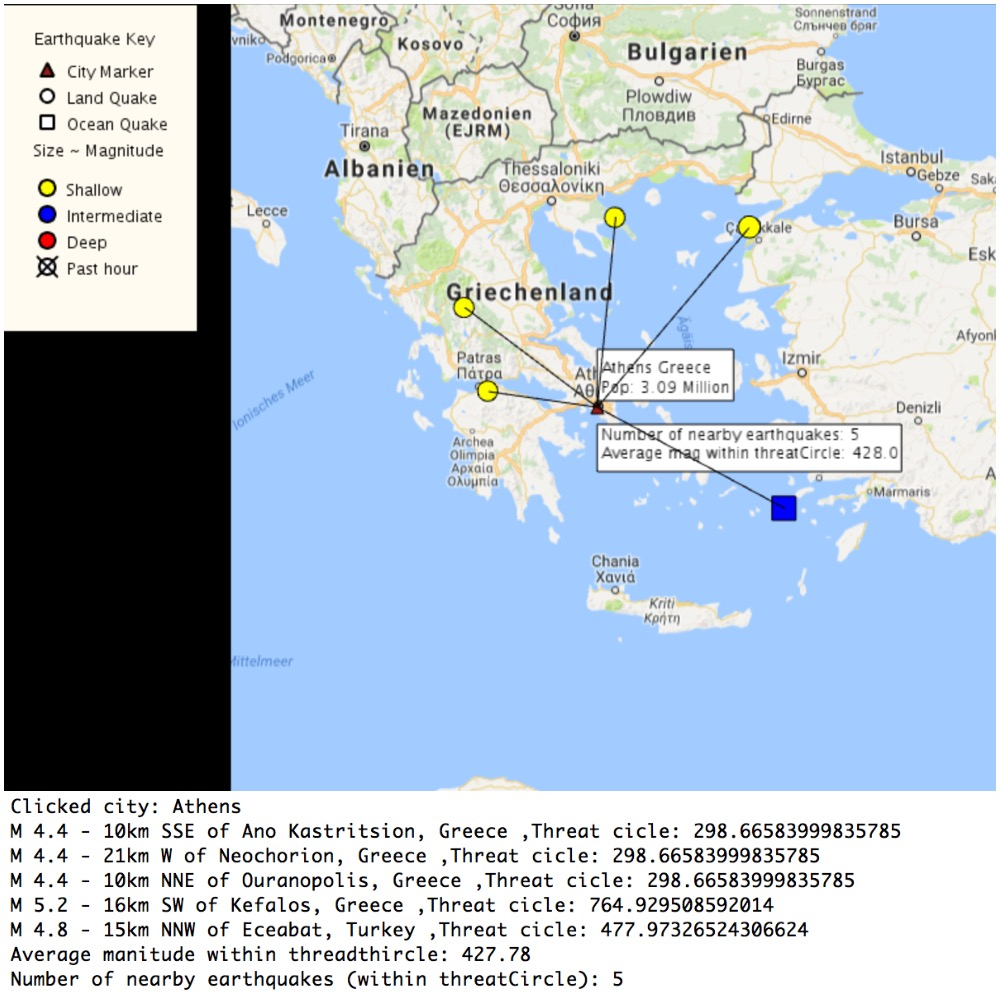

# Project Description
The main purpose of this project is build a GUI in Java to show earthquake information using Google map and add different earthquake features.

# Library
[UnfoldingMaps](http://unfoldingmaps.org/) | [Processing](https://processing.org/reference/libraries/)
-|-|

# Technical Implementation

I added two features into my Earthquake city map:
1. The first one is when the user clicks on a city, the map will display a popup menu either on or off the map which displays a count for the number of nearby earthquakes and their average magnitude. You can check my **screenshot** to see this new feature.
In addition, I also included more information of the clicked city and the earthquake which threat circle contains the city in
the Eclipse console.

2. The second one is I drew a line between the clicked city and earthquake which is useful for the user to visualize the influence
of the earthquake.

For the module 6 code deteils:
The main modification and extension I made is in the `EarthquakeCitymap` class and `CityMarker` class.
In the `checkCitiesForClick()` method of `EarthquakeCityMap` class, if the user clicked on a city, all the earthquakes' threat circle that include the city will be recorded and their location information will be added to a array list called `lc` (store the earthquakes' location information).
Then, I called the `getProperties()` method of city marker and returned a HashMap called `prop`. Then, I will put the earthquake information(magnitude, location, threat circle) into the `prop` which is be used in the `cityMarker` class.

In the meantime, I also print out the information of earthquake and city quake in the Eclipse console which will be easily read by the user.

In the `drawMarker()` method of `cityMarker` class, if the `getClicked()` is true, I will get the properties of this city marker using `getProperties` method. Since I have already store the information of threat circle earthquake information so I can use it right now to draw lines
between city quake and earthquake. Next, I use the `ScreenPosition` class to convert earthquake location to x, y coordinates in the screen. Then, I can use this coordinates to draw lines to show the relationship between city quake and earthquakes.

So this is a general technical description of extensions I have done. If anybody have questions about my implementation,
feel free to contact me or pull request. My email address is song.923@osu.edu.

# License
MIT